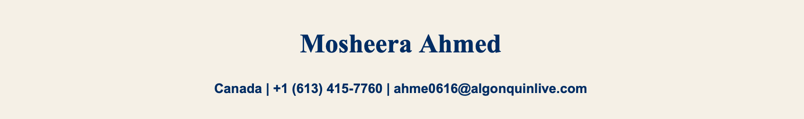
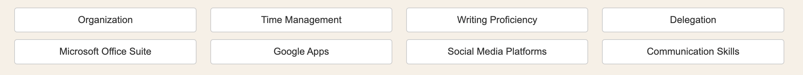
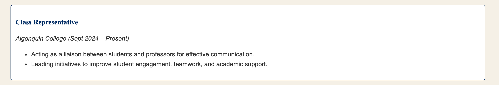
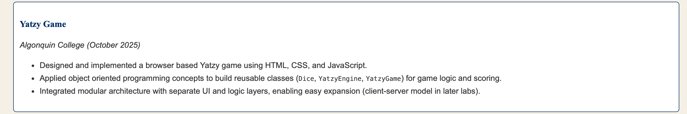
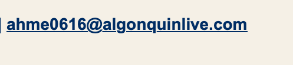
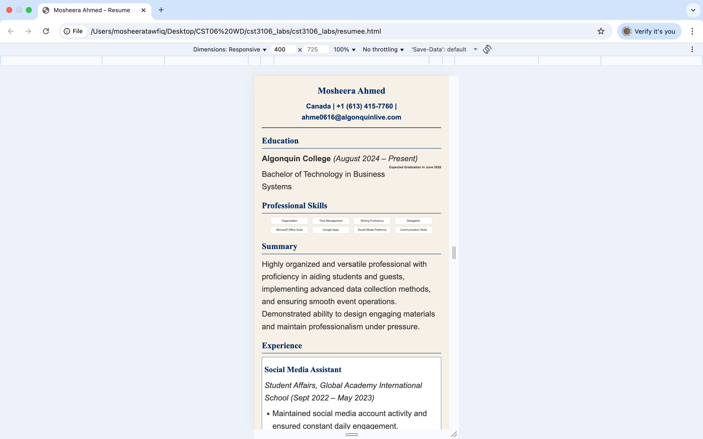

# Mosheera Ahmed – Design System Documentation

This documentation provides a clear and simplified overview of the design system used for the portfolio project. It includes colors, typography, components, and layouts, along with screenshots of mock-ups for clear communication of the design

## **1. Color Palette**
- **Primary Color:** `#0a2a66`
- **Text Color:** `#333`
- **Background Color:** `#f5f0e6`
- **Card Background:** `#fff`
- **Border Color:** `#ccc`

## **2. Typography**
- **Body Text:** `Arial, sans-serif`
- **Headers:** `"Times New Roman", serif`

## **3. Components and Layout**

### Header
- **Design:** Centered name with navy underline. Contact info in navy, email is clickable.  
- **Mock-up Screenshot:**  

### Section Title
- **Design:** Serif heading with navy underline.  
- **Mock-up Screenshot:**  

### Skills Grid
- **Design:** 4-column grid on desktop, shrinks to 2 columns (tablet) or 1 column (phone). Each skill in a small card.  
- **Mock-up Screenshot:**  

### Experience Card
- **Design:** White card with navy border, rounded corners, serif job title.  
- **Mock-up Screenshot:**  

### **Yatzy Game Project Card**
- **Design:** Consistent with experience cards (same border, padding, and typography).  
- **Purpose:** Highlights technical achievement and project-based learning.  
- **Content Example:**
  - Built a browser-based Yatzy game using **HTML5, CSS, and JavaScript**.  
  - Implemented object-oriented classes (`Dice`, `YatzyEngine`, `YatzyGame`) and game logic (straights, full house, bonuses).  
  - Designed modular architecture separating UI and logic, supporting future **client-server** upgrades.  
  - **Mock-up Screenshot:**  
  

### Links
- **Design:** Navy bold links. Underline appears on hover for discoverability.  
- **Mock-up Screenshot:**  

## **4. Responsiveness**
- Skills grid: 4 → 2 columns at `1440 x 812` and `400 x 595`.  
- Content remains readable and centered.  

## **Conclusion**
This design system documents the design aspects of my portfolio project. It includes the colors, fonts, and components used in my resume project and ensures consistency across all future work..
